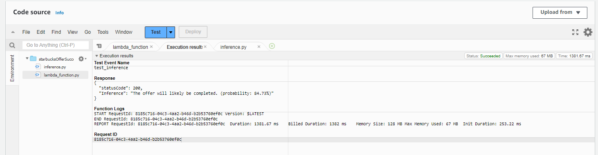

# Starbucks Offer Acceptance Forecast Model With AWS

In this capstone project, as an AWS machine learning engineer, I developed a Starbucks offer acceptance forecast model using AWS services and machine learning techniques. By leveraging the provided data and applying data preprocessing and feature engineering, I built a model to predict whether a customer is likely to accept a Starbucks offer.

Starting with a baseline model using a decision tree, I achieved a benchmark ROC AUC score of 0.73. The final model surpassed the benchmark achieving a value of 0.87, demonstrating improved accuracy and ROC AUC score. Also the model was deployed in a endpoint and could be accesed outside sagemeker by a lambda function.

Overall, this project showcased the AWS machine learning engineer's proficiency in leveraging various AWS services, such as Amazon SageMaker, S3, IAM and AWS Lambda, to build  a end-to-end solution. The utilization of machine learning techniques, combined with effective data preprocessing and feature engineering, resulted in a model that provided accurate predictions for Starbucks offer acceptance.

For detailed information go to project report.pdf file.

## Functionality

The code performs the following steps:

1. Data Gathering and Cleaning:
   - Reads the data files: `portfolio.json`, `profile.json`, and `transcript.json`.
   - Preprocesses the data by handling missing values, renaming columns, converting data types, and performing one-hot encoding.

2. Exploratory Data Analysis:
   - Analyzes the distribution of gender, age, and income in the customer profile dataset.
   - Visualizes the distribution of event types in the transcript dataset.

3. Building Offer Dataset:
   - Combines the transcript, portfolio, and profile datasets to create an offer dataset.
   - Calculates the completion rate for each offer.
   - Filters out incomplete data and unnecessary columns.

4. Model Training and Evaluation:
   - Definition of baseline metric and performance.
   - Comparison between different models.
   - Definition of the aproach to be followed in the AWS implementation.

5. Model deployment

   - Data setup with S3.
   - Creation and model Hyperparameter tunning
   - Endpont Deployment

6. Interfacing with the model.

   - Lambda function creation.
   - IAM access management
   - Logic implementation in lambda function. 

